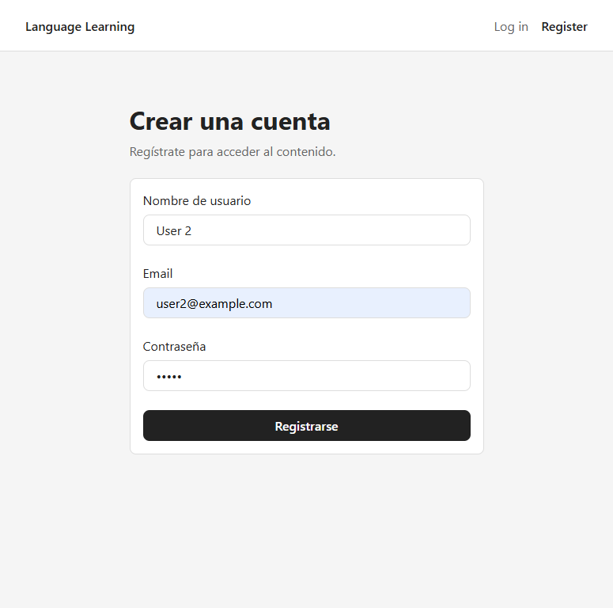
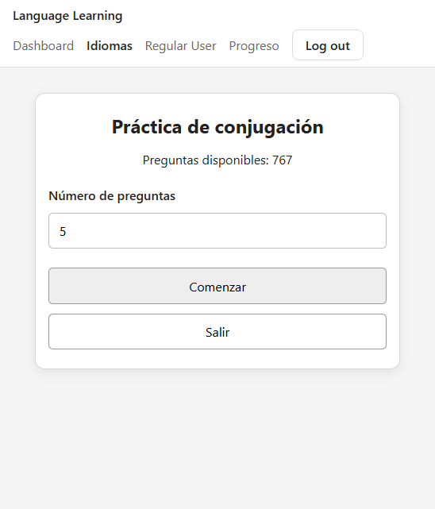
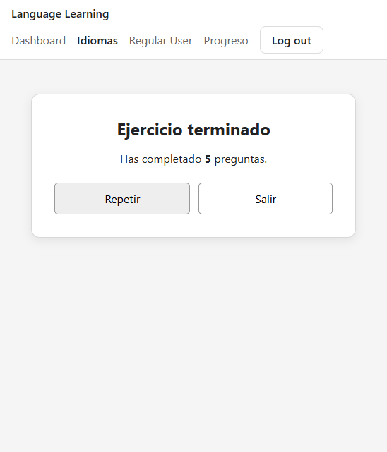

# 🧿 # Language Learning — Full Stack MVP

Aplicación Full Stack desarrollada como proyecto final de **ThePower**.

El proyecto es un **MVP de una plataforma de estudio de idiomas orientada al usuario estudiante**. Permite autenticarse, navegar por idiomas y cursos, acceder a sus unidades y realizar actividades de estudio utilizando contenido almacenado en MongoDB.

La aplicación está diseñada para continuar creciendo después de esta entrega. La arquitectura se mantiene modular para facilitar la incorporación de nuevos ejercicios, contenidos, progreso avanzado y un futuro dashboard de administración.

---

## Demo

### Frontend

https://fullstack-project-frontend-nine.vercel.app/

### Backend

https://fullstack-project-backend-woad.vercel.app/

Healthcheck del backend:

```text
GET /
→ { "message": "Backend is running" }
```

Frontend y backend están desplegados de forma independiente en **Vercel** y se comunican mediante la API REST.

La aplicación también puede ejecutarse completamente en local.

---

## MVP

El flujo principal implementado es:

```text
Register / Login
        ↓
     Languages
        ↓
      Courses
        ↓
       Units
        ↓
     Exercise
```

El MVP incluye actualmente una actividad funcional de **conjugación de verbos portugueses**.

El usuario puede seleccionar el número de preguntas, responder conjugaciones, recibir feedback inmediato y repetir o finalizar la sesión.

---

## Funcionalidades implementadas

* registro de usuarios;
* login y logout;
* autenticación mediante JWT;
* restauración de sesión;
* rutas protegidas;
* selección de idioma;
* consulta de cursos;
* navegación por unidades;
* contenido obtenido desde MongoDB;
* práctica de conjugación;
* selección aleatoria de preguntas;
* validación de respuestas;
* feedback correcto/incorrecto;
* pronunciación cuando está disponible;
* interfaz responsive;
* páginas base de dashboard y progreso.

El MVP está enfocado al **usuario estudiante**.

El backend contiene además modelos y endpoints CRUD preparados para futuras funcionalidades administrativas y para ampliar contenido, ejercicios y progreso. No todos estos endpoints son consumidos todavía por el frontend.

---

## Screenshots

### Login / Register


| Register | Login |
|---|---|
|||

### Selección de idiomas y cursos

| Idioma | Curso |
|---|---|
|||

### Unidades

| Curso | Unidades |
|---|---|
|||


### Ejercicio de conjugación

| Idioma | Curso ||
|---|---|-|
||| |


### Dashboard (mock)


---

## Tecnologías

### Frontend

* React
* TypeScript
* Vite
* React Router
* CSS Modules

### Backend

* Node.js
* Express
* TypeScript
* MongoDB
* Mongoose
* JSON Web Tokens
* bcrypt
* CORS
* csv-parse

### Deployment

* Vercel
* MongoDB Atlas

---

## Arquitectura

El proyecto utiliza **dos repositorios independientes**:

```text
fullstack-project-frontend
fullstack-project-backend
```

El frontend consume la API mediante la variable:

```env
VITE_API_URL=<variable>
```

El backend permite el origen del frontend mediante:

```env
FRONTEND_URL=<variable>
```

Esto permite mantener ambos proyectos desacoplados y desplegarlos independientemente.

---

## Arquitectura del frontend

```text
src/
├── components/
│   ├── auth/
│   ├── exercises/
│   ├── layout/
│   └── ui/
├── context/
├── hooks/
├── mocks/
├── pages/
├── services/
├── styles/
├── types/
├── App.tsx
└── main.tsx
```

Principales responsabilidades:

* `components` → componentes reutilizables;
* `pages` → pantallas y composición;
* `services` → comunicación con la API;
* `context` → estado global de autenticación;
* `hooks` → lógica React reutilizable;
* `types` → tipos TypeScript;
* `styles` → variables y estilos globales.

---

## Arquitectura del backend

```text
src/
├── api/
│   ├── controllers/
│   ├── models/
│   └── routes/
├── config/
├── middlewares/
├── utils/
│   └── seeds/
└── index.ts
```

La API separa modelos, controllers, rutas, middlewares y utilidades para mantener las responsabilidades independientes.

---

## Base de datos

La base de datos utiliza MongoDB y Mongoose.

Entre las principales colecciones se encuentran:

```text
users
languages
courses
portugueseVerbConjugations
vocabulary
exercises
progresses
```

Ejemplos de relaciones:

```text
Language
   ↑
 Course
   ↑
PortugueseVerbConjugation

User → Progress → Course
               → Exercise
```

Las unidades se encuentran embebidas dentro de los documentos `Course`.

---

## Carga inicial de datos

Los datos iniciales de MongoDB se cargan mediante **seeds**, que permiten reconstruir de forma controlada la información necesaria para ejecutar el MVP.

Para realizar la carga completa deben ejecutarse **dos seeds, en este orden**:

```bash
npm run seed:all
npm run seed:ptverbs
```

Los scripts correspondientes están definidos en `package.json`:

```json
"seed:all": "tsx src/utils/seeds/master.seed.ts",
"seed:ptverbs": "tsx src/utils/seeds/portugueseVerbConjugation.seed.ts"
```

### 1. Master seed

```bash
npm run seed:all
```

El `master.seed.ts` ejecuta en orden los seeds necesarios para crear los datos base y respetar las dependencias entre colecciones:

```text
Users
  ↓
Languages
  ↓
Courses
```

* **Users** → crea los usuarios iniciales de prueba, incluyendo usuario y administrador.
* **Languages** → carga los idiomas disponibles.
* **Courses** → crea los cursos y sus unidades embebidas, relacionándolos con los idiomas correspondientes.

El orden es importante porque los cursos necesitan que los idiomas existan previamente para poder crear correctamente sus relaciones.

### 2. Seed de conjugaciones portuguesas

Después del master seed debe ejecutarse:

```bash
npm run seed:ptverbs
```

Este seed carga la colección `portugueseVerbConjugations`, utilizada por el ejercicio funcional de conjugación del MVP.

Los datos se importan desde un archivo **CSV** mediante el siguiente proceso:

```text
CSV
 ↓
Node.js fs
 ↓
csv-parse
 ↓
validación de datos
 ↓
resolución de Course / Unit
 ↓
MongoDB
```

Este seed debe ejecutarse después de `seed:all` porque necesita que los cursos y sus unidades ya existan para localizar sus identificadores de MongoDB y crear correctamente las relaciones.

Por tanto, la secuencia completa de carga es:

```text
npm run seed:all
        ↓
Users → Languages → Courses
        ↓
npm run seed:ptverbs
        ↓
Portuguese Verb Conjugations
```

Esta estructura permite reconstruir fácilmente los datos iniciales del MVP y mantener separados los datos generales de la aplicación del dataset específico utilizado por el ejercicio de conjugación.


---

## Autenticación

El backend utiliza JWT para autenticar usuarios.

Flujo:

```text
Login
 ↓
Backend valida credenciales
 ↓
JWT
 ↓
Frontend guarda el token
 ↓
ProtectedRoute
```

Al recargar la aplicación, `AuthProvider` utiliza:

```text
GET /api/v1/auth/me
```

para validar el token y restaurar la sesión.

Las contraseñas se almacenan mediante hash con `bcrypt`.

---

## API

Algunos de los principales recursos disponibles son:

```text
/api/v1/auth
/api/v1/users
/api/v1/languages
/api/v1/courses
/api/v1/vocabulary
/api/v1/exercises
/api/v1/progress
/api/v1/portuguese-verb-conjugations
```

El frontend utiliza actualmente los endpoints necesarios para el MVP.

Otros endpoints CRUD forman parte de la infraestructura preparada para futuras fases, especialmente la gestión de contenido y el dashboard administrativo.

---

## Ejecución local

### Backend

```bash
git clone <BACKEND_REPOSITORY>
cd fullstack-project-backend
npm install
```

Crear un archivo `.env` a partir de `.env.example` agregando los valores necesarios:

```env
PORT=3000
MONGO_URI=
JWT_SECRET=
FRONTEND_URL=http://localhost:5173
```

Ejecutar:

```bash
npm run dev
```

El backend estará disponible normalmente en:

```text
http://localhost:3000
```

---

### Frontend

```bash
git clone <FRONTEND_REPOSITORY>
cd fullstack-project-frontend
npm install
```

Crear `.env`:

```env
VITE_API_URL=<variable>
```

Ejecutar:

```bash
npm run dev
```

Vite utilizará normalmente:

```text
http://localhost:5173
```

---

## Variables de entorno

Las variables privadas **no se incluyen en los repositorios**.

Los repositorios incluyen archivos `.env.example` como referencia.

Para la evaluación del proyecto, las variables necesarias para conectar con la base de datos se proporcionan de forma independiente mediante la plataforma de entrega.

---

## Diseño

El diseño visual del MVP es deliberadamente sencillo.

Se ha priorizado:

* claridad;
* navegación;
* responsive;
* componentes reutilizables;
* separación modular;
* facilidad para modificar posteriormente la interfaz.

Esta decisión permite desarrollar en una siguiente fase una identidad visual más completa y un dashboard administrativo sin rehacer la arquitectura de la aplicación.

---

## Estado del proyecto

**MVP funcional.**

La versión entregada demuestra el flujo Full Stack principal del usuario estudiante:

```text
React
  ↓
API REST
  ↓
Node / Express
  ↓
MongoDB
```

El proyecto continuará desarrollándose después de la entrega.

### Próximas fases

* nuevas actividades de aprendizaje;
* más contenido e idiomas;
* progreso persistente ampliado;
* mejoras de dashboard;
* administración de contenido;
* dashboard para administradores;
* evolución del diseño visual.

---

## Autor

Proyecto final desarrollado para **ThePower Full Stack Developer**.
